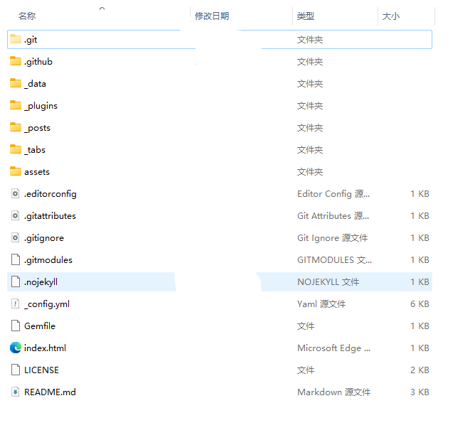
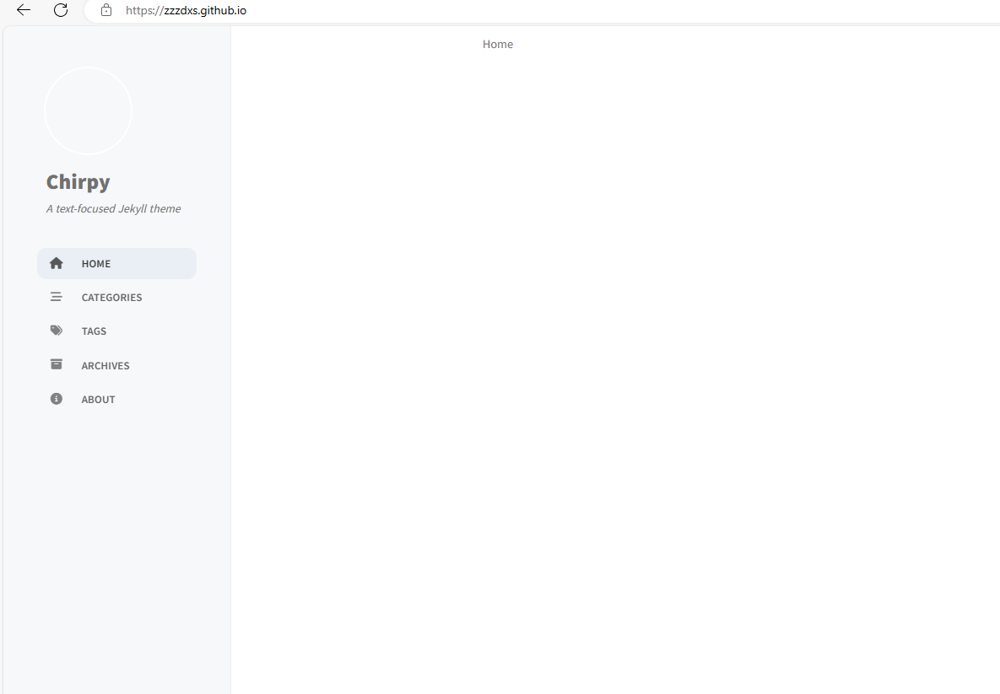

# 从零开始的菜鸟摸鱼试错之路

<!-- markdownlint-disable MD033 -->

## ———从零开始的个人主页

## 0 准备

此部分对应从0开始的blog网页创建，更加自由但需要从0开始搭建，所以后面我就没用了【

不过虽然没用上，但可以借此机会再熟悉git的使用~

所以其实在完成git和Jekyll的下载安装之后直接跳转[网站设计](#1-网站设计)就好，都不用在准备中新建仓库~~~TT

### 0.1 GitHub使用

在GitHub网站新建`username.github.io`命名的Repository仓库，并在本地新建对应的仓库。开始使用GitHub托管代码前首先生成本设备SSH密钥。

打开终端。

```Shell
ssh-keygen -t rsa -C "useremail@example.com"
```

对密钥文件进行命名及设置密码（可选），在该终端对应的文件夹中就可以找到生成的公钥`example.pub`和私钥`example`。向GitHub账户的`setting`中添加SSH密钥，将公钥`example.pub`内容复制并保存。

打开*本地仓库文件夹*对应的终端。

```git
git init
git add .
git commit -m "Initial commit"
git remote add origin <HTTPS remote repository URL>/<SSH remote repository URL>
```

出现问题：

<details>
<summary>1. Git无法使用SSH公钥进行身份验证</summary>
<p> 报错内容：</p>
<pre><code class="language-Shell">git@github.com: Permission denied (publickey).
fatal: Could not read from remote repository.

Please make sure you have the correct access rights
and the repository exists.
</code></pre>
<p> 解决方法：</p>
<p> 参考 <a href="https://docs.github.com/zh/authentication/keeping-your-account-and-data-secure/githubs-ssh-key-fingerprints" target="_blank">GitHub 的 SSH 密钥指纹</a>向文件<code>~/.ssh/known_hosts</code>中添加相应内容。
 之后依然报错，在终端查看生成的SSH私钥路径是否正确：</p>
<pre><code class="language-shell">git config --global --get core.sshCommand
</code></pre>
<p> 如果路径不正确则修改为正确路径。</p>
<pre><code class="language-Shell">git config --global core.sshCommand &quot;ssh -i /path/to/private/key&quot;
</code></pre>
<p> 修改为正确的路径，注意<code>/path/to/private/key</code>修改为之前生成的SSH私钥的完整路径，并注意路径分隔符的正斜线和反斜线使用。</p>
<p> 如果路径正确，再查看GitHub账户是否有该仓库的访问权限，以及账户的SSH密钥是否设置正确。</p>
</details>

<details>
<summary>2. 本地仓库与远程仓库不同步</summary>
<p>报错内容：</p>
<pre><code class="language-shell">PS path\path\&gt;git push -u origin main
To github.com:zzzdxs/dxszzz.github.io.git
 ! [rejected]        main -&gt; main (fetch first)
error: failed to push some refs to &#39;github.com:zzzdxs/dxszzz.github.io.git&#39;
hint: Updates were rejected because the remote contains work that you do
hint: not have locally. This is usually caused by another repository pushing
hint: to the same ref. You may want to first integrate the remote changes
hint: (e.g., &#39;git pull ...&#39;) before pushing again.
hint: See the &#39;Note about fast-forwards&#39; in &#39;git push --help&#39; for details.
</code></pre>
<p>解决方法：同步本地仓库与远程仓库内容。</p>
<p>在开始项目之前我添加了一些不需要的文件，之后把它们删除，从头开始设置本地仓库：</p>
<pre><code class="language-git">git init
hint: Using &#39;master&#39; as the name for the initial branch. This default branch name
hint: is subject to change. To configure the initial branch name to use in all
hint: of your new repositories, which will suppress this warning, call:
hint:
hint:   git config --global init.defaultBranch &lt;name&gt;
hint:
hint: Names commonly chosen instead of &#39;master&#39; are &#39;main&#39;, &#39;trunk&#39; and
hint: &#39;development&#39;. The just-created branch can be renamed via this command:
hint:
hint:   git branch -m &lt;name&gt;
Initialized empty Git repository in E:/path/path/.git/
</code></pre>
<p>终端给出提示，从前Git默认主分支名称是<code>master</code>，该名称可以通过<code>git config --global init.defaultBranch &lt;name&gt;</code>修改。为了和远程仓库同步的方便，修改本地主分支的默认名称。</p>
<p>首先了解本地仓库的默认分支名称：</p>
<pre><code class="language-git">git branch --show-current
</code></pre>
<p>可以仅修改此仓库的名称<code>master</code>为<code>main</code>:</p>
<pre><code class="language-git">git branch -m master main
</code></pre>
<p>亦可根据上述提示修改默认分支名称。</p>
<p>修改完完毕后和远程仓库进行同步：</p>
<pre><code class="language-git">git remote add origin &lt;remote_url&gt;
</code></pre>
<p>查看远程分支：</p>
<pre><code class="language-git"> git remote show origin
</code></pre>
<p>显示：</p>
<pre><code class="language-git">* remote origin
  Fetch URL: git@github.com:...
  Push  URL: git@github.com:...
  HEAD branch: main
  Remote branch:
    main new (next fetch will store in remotes/origin)
</code></pre>
<p>说明：本地仓库已经与远程仓库成功关联，并且远程仓库的默认分支是main。</p>
<p>参考教程<a href="https://www.liaoxuefeng.com/wiki/896043488029600/896954848507552" target="_blank">分支管理</a></p>
<p>同步远程仓库的内容到本地仓库：</p>
<pre><code class="language-git"> git pull origin "branch-name" </code></pre>
<p>此时远程仓库和本地仓库实现同步。在此基础上提交本地修改再和远程同步就不会有冲突。</p>
<p>更多有关git的内容可参考分支管理git学习</a></p>
</details>

### 0.2 GitHub Pages 和 Jekyll 搭建个人网站

参考[GitHub Pages 快速入门](https://docs.github.com/zh/pages/quickstart){: target="_blank"}在新建的远程仓库设置中打开pages选项，并设置Branch显示的文件夹为`/dos`配置Github Pages站点的发布源。

此时通过`https://username.github.io`已经可以查看网页。

根据[Jekyll win版本安装指导](https://jekyllrb.com/docs/installation/windows/){: target="_blank"}下载Jekyll。

在本地仓库对应文件夹中打开终端，运行`jekyll new <your-site-name>`创建一个基本的Jekyll网站。这将生成一个包含默认文件和目录结构的新网站。

通过编辑 Jekyll 网站根目录中的文件来定制个人博客。你可以修改页面内容、布局、样式、配置等，可以使用 Markdown 或 HTML 编写新的文章或页面，并在 _posts 或_pages 目录中保存它们。

可以参考[jekyll目录结构](https://jekyllrb.com/docs/structure/){: target="_blank"}

```txt
.
├── _config.yml       # Jekyll 配置文件
├── _layouts          # 存放布局文件
├── _includes         # 存放可重用的代码片段
├── _data             # 存放数据文件，如 YAML、JSON 等
├── _posts            # 存放博客文章（Markdown 文件）
├── assets            # 存放静态资源，如 CSS、JavaScript、图像等
└── index.html        # 网站首页
```

在相应文件夹终端运行`Jekyll serve`，通过访问预览地址（通常为 `http://localhost:4000`）在本地来预览博客修改效果。当满意并确认修改后的效果时，将修改后的文件推送到 GitHub 仓库，这样博客网站将自动更新。


至此我们的准备工作就圆满完成啦~

## 1 网站设计

从GitHub上找到一个心仪的主题。我找的主题是[jekyll-theme-chirpy](https://github.com/cotes2020/jekyll-theme-chirpy){: target="_blank"}。根据该项目的文档，我们利用chirpy starter新建一个repository，并同步到本地仓库，这样再修改本地文件。



此时打开对应网站长这样：



在终端运行`bundle`以安装相关依赖。

在终端运行`bundle exec jekyll s`以在本地预览网页。预览网址也是`http://localhost:4000`。

然后根据文档修改就好~~~ 
