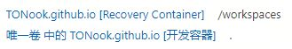

# 简单Blog搭建

2024Blog记录只进行了一次就草草结束，本文是再次从搭建Blog开始重新梳理，再启Blog之旅。且本次搭建Blog的方式相比2024版，采用Docker Desktop镜像并通过VSCode远程连接更加方便，虽然网络上已有诸多教程但还是为了记录这一过程写下这篇记录。

因笔者计算机基础知识薄弱，可能存在诸多低级错误，做此声明。

> 本文主要内容包括两部分，一是笔者不熟悉的一些基础概念的介绍聊作备忘，二是具体的实践步骤，只看具体过程请直接跳转[前期准备](#1-先决条件)。\
笔者采用[Chripy](https://github.com/cotes2020/jekyll-theme-chirpy/){: target="_blank"}，具体操作步骤也是和[官方教程En](https://chirpy.cotes.page/posts/getting-started/){: target="_blank"}、[官方教程zhCN](https://pansong291.github.io/chirpy-demo-zhCN/posts/getting-started/){: target="_blank"}一致。

需要注意的是，笔者在远程连接时总是出错，因此反复重新进行了好几遍才成功，其实关键非常简单，就是一定要保证网络环境的畅通，所以在操作前一定要确认这一点，再进行接下来的一系列copy操作就用不了几分钟啦！比如可以不用GitHub，改用Gitee。但笔者是个死脑筋所以还是继续在Github上尝试 (ˉ▽ˉ；)...

## 0 概念学习

### 0.1 Github Pages和Jekyll是啥

- **Github Pages**:一个免费的网站托管平台，直接从你的GitHub仓库​生成网页。需要注意的是这里只能生成静态网页，而不能跑数据库或太复杂的程序。

- **Jekyll**：一个静态网站生成器，把简单的文本（如Markdown）转换成漂亮的网页。Jekyll是一个开源的静态网页生成器，将简单的Markdown文件自动转为html文件，对于非代码技术背景的本人十分友好~且因为是将Markdown文件转为网页，所以非常适合富文本类型的博客网站。在笔者理解下就是为用户搭建了一个较为格式化的网站框架，用户可以基于此框架依据相应的规则再进行相应的内容填充。

### 0.2 Docker是啥

#### 容器化

- **容器化**：容器化是一种软件部署流程，它将程序项目及其依赖的所有文件和库等等依赖项一整个打包，封装成一个独立的开发空间。这是一种操作系统级别的虚拟化，容器化的部署就像是运行了一个项目所需的“最小虚拟机”，而因为共享了宿主机的操作系统内核，不需要再运行一个完整的操作系统，达到更高效、便捷、可扩展、易于管理的利用，实现一个“开箱即用”。

- **Docker**：Docker容器就是一个轻量级的、可移植的、自给自足的软件环境，是最流行的容器化实现工具之一。
  - *Develop faster. Run anywhere.*

> 腾讯元宝给了我如下的容器化工具推荐：
> 
>| 场景               | 推荐工具                              | 说明                          |
>|--------------------|---------------------------------------|-------------------------------|
>| ​**个人开发/小型项目**​ | Docker + Docker Desktop              | 生态完善，学习成本低。           |
>| ​**企业级生产环境**​   | Kubernetes + CRI-O/Podman            | 高稳定性、支持大规模集群。       |
>| ​**高性能计算（HPC）​**​ | Singularity                          | 专注于安全隔离和资源调度。       |
>| ​**无服务器场景**​     | Firecracker + AWS Fargate           | 超低延迟、按需付费。           |

#### 核心概念

- **Dockerfile**：定义需要的清单文件，定义镜像的构建规则，指导如何一步步构建镜像，如规定安装软件、复制文件、设置环境变量的步骤。

- **镜像Image**：镜像文件，可以理解为一种**静态**模板，docker就根据这个镜像来创建容器。

- **容器Container**：容器就是镜像的一个运行实例，可以指定代码、修改文件、访问网络，每个容器互不干扰。删除容器不会影响镜像，删除镜像则会导致所有相关容器失效。

[如何优雅地删除Docker镜像和容器（超详细）](https://blog.csdn.net/u014282578/article/details/127866389){: target="_blank"}


> P.S. 笔者在第二次打开网页的时候发现打开历史出现了两个远程仓库的记录👇
> 
> <br>
> 
> 迷茫之际赌了一个打开，结果就是赌错了，导致在终端怎样都无法运行相关的命令，质疑Docker之际发现是打开了Recovery Container，可以看出笔者是非常之小白(lll￢ω￢)
> 
> 这两个容器分别是**恢复容器**（Recovery Container）和**开发容器**（Development Container）。恢复容器通常用于系统恢复或备份，而开发容器则是日常开发使用的环境。
> 
> | 容器类型          | 主要用途                               | 设计特点                                                                 |
> |-------------------|--------------------------------------|--------------------------------------------------------------------------|
> | ​**Recovery Container**​ | 系统恢复/数据备份                    | - 仅包含基础系统工具<br>- 可能预装备份脚本或恢复工具<br>- 无开发依赖<br>- 安全性优先：可能限制非root用户权限                                       |
> | ​**开发容器**​        | 日常编码、调试、运行项目              | - 完整开发环境（如 Ruby、Node.js、VSCode）<br>- 数据卷共享开发数据<br>- 支持交互式终端和调试工具       |
>
> 因此再次打开的时候选择**开发容器**即可。


### 0.3 笔者的误会

Q1：VSCode远程连接GitHub仓库是通过什么实现的，Docker吗？

A1：在使用过程中，Vscode会远程连接Github仓库，笔者一开始误以为是Docker本身可以实现远程连接，但其实和Docker无关，远程连接本质上是通过 **SSH协议 /WSL(Windows Subsystem for Linux)**，而使用Docker Desktop作为远程开发环境，VSCode的连接逻辑则是 **​Docker Desktop + Remote Development 扩展**，启用容器后，通过浏览器或VSCode **Remote - Containers**直接访问容器内的 VSCode 实例，GitHub 连接依赖容器内的 SSH 配置。

--- 

Q2：一般不再额外设置的话，VSCode远程打开的不同仓库都会使用同一个镜像吗、同一个仓库都会使用同一个镜像吗？

A2：
**不同仓库**是否使用同一个镜像取决于仓库的配置，若仓库的 devcontainer.json 或 Dockerfile 相同，则镜像可能复用且各仓库会构建独立的容器；若仓库的配置不同则会使用不同的镜像。
**同一个仓库**每次打开使用的镜像也是根据仓库彼时彼刻的具体配置，如果没有更改则可以使用之前的镜像而无需重复构建。二次打开同一仓库时，复用镜像并形成新容器，文件卷会保持上次的状态。

---

Q3：每次关闭VSCode和Docker后容器就消失下次再打开时再重新构建吗？

A3：关闭VSCode，则容器停止镜像保留。


## 1 先决条件

### 1.1 应用安装

- 根据官方教程[^ft1]，所需应用包括:
  1. [Docker Desktop](https://www.docker.com/products/docker-desktop/){: target="_blank"}
  2. [Ruby和Jekyll](https://jekyllrb.com/docs/installation/windows/){: target="_blank"}
  3. [GCC](https://blog.csdn.net/qq_45601448/article/details/109158588){: target="_blank"}
  4. [Make](https://blog.csdn.net/weixin_41896770/article/details/131262178){: target="_blank"}
  5. [git](https://blog.csdn.net/qq_29493173/article/details/113094143){: target="_blank"}

- 通过命令检查已经安装完毕\
  `ruby -v`, `gem -v`, `gcc -v`, `g++ -v`, `make -v`, `git -v`

- VSCode下载插件：Dev Containers


### 1.2 账号创建

- **配置Github仓库**：根据官方教程[^ft1]使用Starter新建仓库并命名为`username.github.io`，这样才能通过`https://username.github.io`的格式打开博客，其中username为GitHub账户名称
  > 如使用不是username命名，则可以通过`https://username.github.io/repositoryname`的格式进行访问

- **配置git**：因我之前有配置过另一个git账户，这次想换一个git账户并隐藏我的邮箱，则可以通过Github的[`noreply` email address](https://docs.github.com/zh/account-and-profile/setting-up-and-managing-your-personal-account-on-github/managing-email-preferences/setting-your-commit-email-address){: target="_blank"}且阻止会暴露个人电子邮件地址的命令行推送
  > 要查询及更改git配置的用户名及邮箱，使用如下命令配置私密邮箱
  > ```git
  > git config user.name
  > git config user.email
  > git config --global user.email "{ID}+{username}@users.noreply.github.com"
  > git config --global user.name "username"
  > ssh-keygen -t rsa -C "youxiang@xxx.com"
  > ```
  > 如允许使用个人电子邮箱则记得取消上面的勾选并在GitHub中同步邮箱的SSH，生成命令行时遇到输入密码等直接回车即可
  > ```git
  > ssh-keygen -t rsa -C "youxiang@xxx.com"
  > ```

## 2 配置

- **运行Docker Desktop**
- **启动VSCode并在容器卷中克隆仓库**[^ft2]
  - <kbd>fn</kbd>+<kbd>F1</kbd>：运行Dev Containers: Clone Repository in Container Volume...
  - 选择相应的仓库开始克隆
  - 保持网络畅通，等待一段时间，就能在VSCode里看到本网页的远程连接啦🎇

## 3 部署

- **本地部署**：在VSCode命令行输入`bundle exec jekyll s`，几秒后可通过`http://127.0.0.1:4000 `访问当前网页
- **Pages部署**：在`Settings -> Pages -> Build and deployment -> Source`中选择`Github Actions`，Github仓库中的代码同步好后就能自动构建，等待几秒，通过`https://username.github.io`就能访问，之后每次更新网页都会同步提醒update

## 4 更新

1. 在本地镜像进行的更改如何通过VSCode向远程仓库同步，可以参考：[[全网最详细]VS Code使用Git可视化管理源代码详细教程](https://blog.csdn.net/zls365365/article/details/125904062){: target="_blank"}
2. 具体如何更新当前站点内容可以参考：[Chirpy+Github](https://www.cnblogs.com/sprinining/p/18427216){: target="_blank"}


---
> 本文结束，感谢您的阅读❤
{: .prompt-tip }

[^ft1]:[Jekyll安装指南](https://jekyllrb.com/docs/installation/){: target="_blank"}
[^ft2]:[仓库远程连接](https://code.visualstudio.com/docs/devcontainers/containers#_quick-start-open-a-git-repository-or-github-pr-in-an-isolated-container-volume){: target="_blank"}
